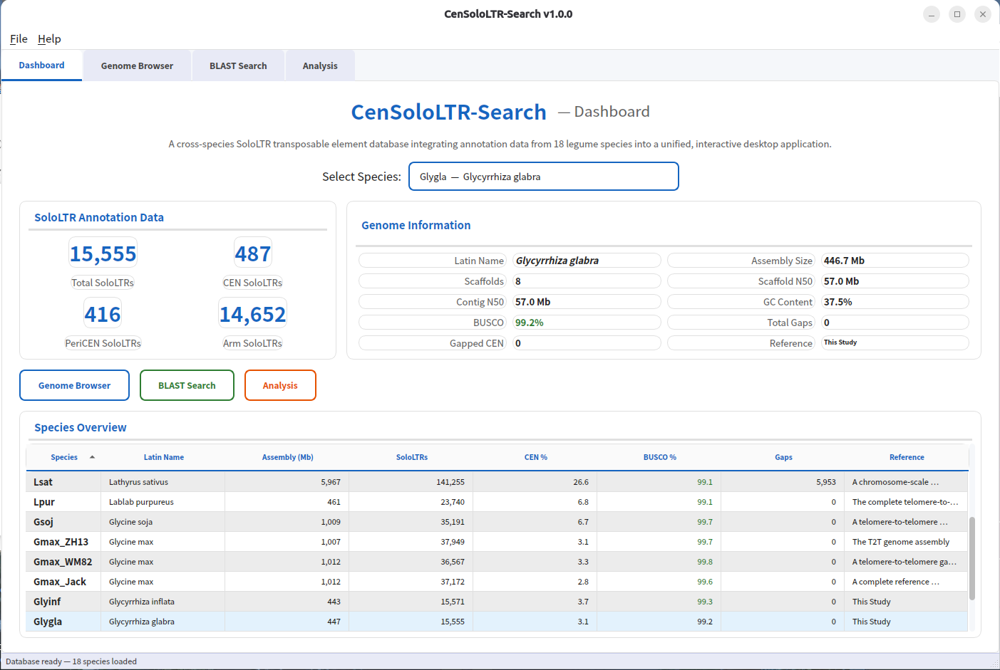
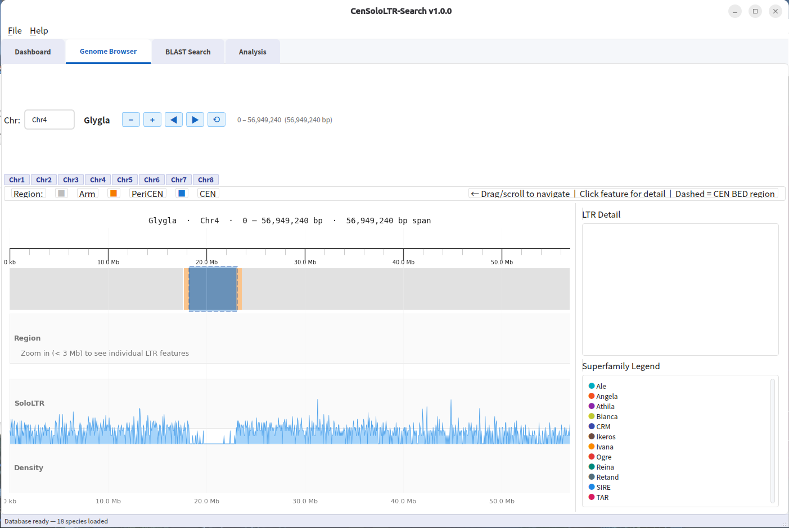
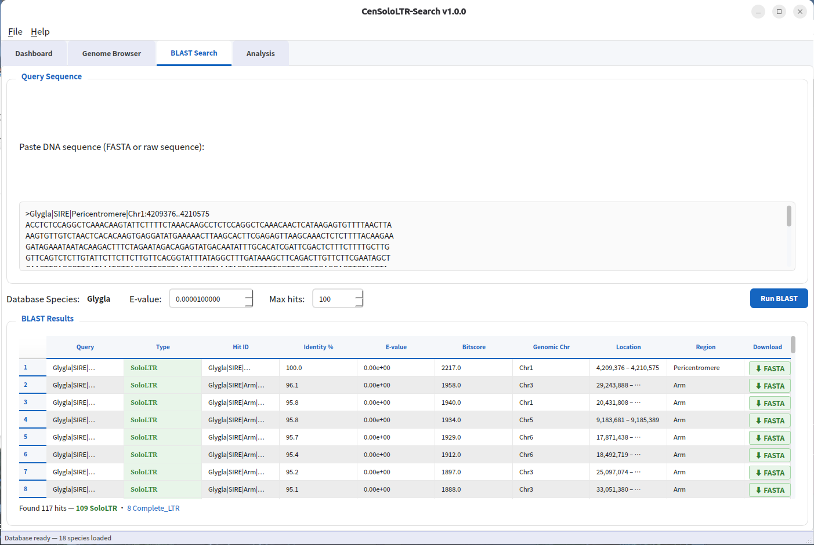
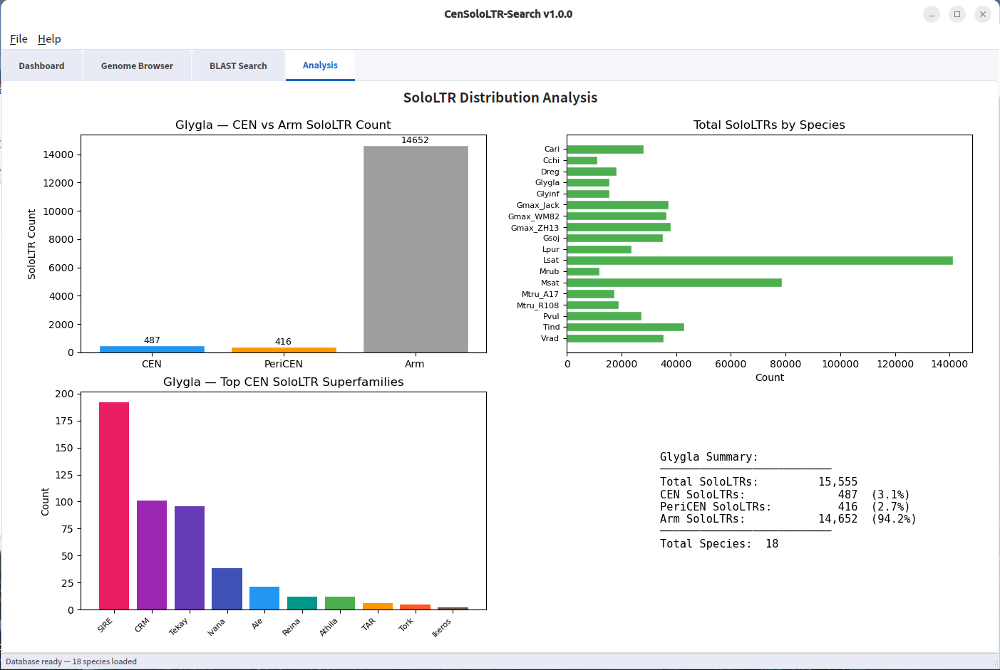

# LTRtrace-Search

LTRtrace-Search is a user-friendly cross-platform desktop application designed for searching, browsing, and analysing de novo annotated centromeric and pericentromeric SoloLTRs.

Created as a dedicated visualization tool, this application independently packages the comprehensive database originally bundled with the CenSoloLTR software. It provides researchers with an intuitive graphical interface to easily access, visualize, and interact with complex structural annotation data across 18 legume (Fabaceae) genomes, eliminating the need for command-line operations.

## Key Features

**Species Dashboard** — Select a legume species to view genome summary statistics, including total LTR counts, centromere/pericentromere/arm region breakdowns, and a sortable species comparison table.



**Genome Browser** — Explore LTR insertions at chromosome-level resolution. Each insertion is colour-coded by superfamily (Ogre, Tekay, SIRE, Athila, etc.) and displayed across three specific region tracks: Centromere, Pericentromere (±500 Kb flanking), and Chromosome Arm.



**BLAST Search** — Paste a FASTA sequence to search against the combined Complete-LTR and SoloLTR database for the selected species. Results show sequence identity, alignment metrics, LTR type, and genomic coordinates. Double-click any hit to instantly jump to its location in the genome browser.



**Analysis Charts** — Interactive visualizations of superfamily composition and regional distribution via pie and bar charts for the selected species.



## Supported Species & Data

**Database Origin**: The application bundles the de novo annotated database derived from the CenSoloLTR pipeline. It contains complete coordinate and sequence data for both SoloLTRs and Complete LTRs.

**Supported Genomes**: 18 legume species, including *Glycine max* (Jack, WM82, ZH13), *Glycine soja*, *Medicago truncatula* (A17, R108), *Lotus japonicus*, *Phaseolus vulgaris*, *Vigna radiata*, and more.

**Offline Capability**: All data is pre-packaged. No external database or internet connection is required for core functionality. The first BLAST search for a species will build a local search index automatically (~30 seconds, cached for subsequent searches).

## Installation

### Linux

Download the AppImage, make it executable, and run:

```bash
chmod +x LTRtrace-Search-1.0.0-x86_64.AppImage
./LTRtrace-Search-1.0.0-x86_64.AppImage
```

### Windows

Download and run `LTRtrace-Search-Setup-1.0.0.exe`. The setup wizard will guide you through the installation process. Once completed, launch the application from the Start Menu or your desktop shortcut.

## Quick Start

1. **Launch** the application to open the default Species Dashboard.
2. **Switch Species** using the dropdown menu at the top to instantly update statistics and charts for different legume genomes.
3. **Explore Genomes** by clicking "Genome Browser" to view detailed LTR insertions along the chromosomes. Zoom and pan to inspect specific regions of interest.
4. **Search Sequences** by navigating to "BLAST Search", pasting a nucleotide FASTA sequence, and selecting your target species.
5. **Visualize Data** in the "Analysis" tab to review superfamily and regional distribution charts.
